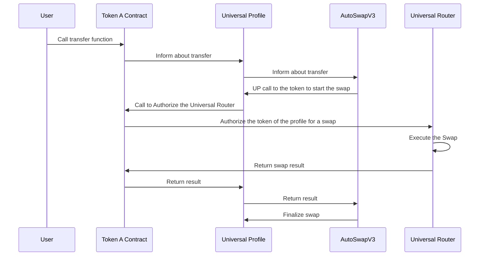

# AutoSwapV3

This repository contains an **LSP1-UniversalReceiverDelegate** contract designed for automatic token swaps on transfers using Uniswap V3-based protocol (UniversalSwaps).

> This is an educational project and only for test purposes. Still a work in progress and is being tested with different configs.

## Overview

The AutoSwapV3 contract is specifically designed to work with LSP7-DigitalAsset tokens, not ERC20 tokens. This is because ERC20 lacks the ability to inform the recipient about the transfer, preventing the recipient from deciding how to react to it. With LSP7, recipient can be notified about the transfers, and then can delegate the reaction to external contracts that decides how to react on transfer. In this case, users will use the `AutoSwapV3` contract. 

## Key Features

- Automatic token swaps on transfer
- Works with LSP7-DigitalAsset tokens
- Works with UniversalSwapsV3

## Setup

This contract needs to be set as the **UniversalReceiverDelegate** for a Universal Profile and should be given the necessary permissions to execute from this profile. In the case of ownership via **LSP6-KeyManager**, it should be given **SUPER_CALL** and **REENTRANCY** permissions.

## Oracle Integration

The AutoSwapV3 contract should include an oracle that feeds the minimum amount of tokens that the user is willing to receive. This amount should be reasonable based on a preferred deviation to protect against sandwich attacks.

## Flow Diagram

The following diagram illustrates the flow of a token transfer and automatic swap:



1. User calls the transfer function on Token A
2. Token A informs the recipient's Universal Profile about the transfer
3. The Universal Profile informs AutoSwapV3 about the transfer
4. AutoSwapV3 calls the Universal Profile to authorize the swap
5. The Universal Profile calls authorizeOperator on the token contract
6. The token contract authorize the UniversalRouter and the authorization data contain the logic for the swap
7. The swap result is returned through the chain of contracts back to AutoSwapV3 and the UniversalProfile

## Usage

To use the AutoSwapV3 contract:

1. Deploy the `AutoSwapV3` contract
2. Set it as the `UniversalReceiverDelegate` for your Universal Profile
3. Grant necessary permissions (`SUPER_CALL` and `REENTRANCY`) if using LSP6-KeyManager
4. Configure minimum swap amounts for each token

## Usage

### Build

```sh
$ forge build
```
### Gas Snapshots

```sh
$ forge snapshot
```

## Contributing

Contributions are welcome! Please feel free to submit a Pull Request.

## License

[MIT License](LICENSE)
